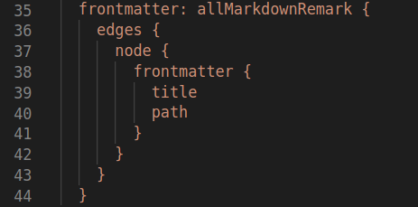
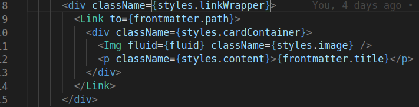
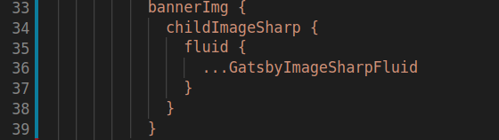

\
First thing we wanna do in a blog site is to display all the blogs in a page so that the user can navigate to required blog post.  
\
We need couple of things to clarify before we start achieving this.  
 
- _Need cards to display in the page_.  
- _Cards click should navigate to respective blog post_.  

\
\
The initial page now will contain all the blog posts that are available. For that we are going to use `gatsby-transformer-remark` plugin which will give us all the markdown files in the project. This is achieved through graphql query.  
\
  

\
Now we got all the markdown files in the application. Loop through the files and create tiles to display the title and author inside the tile. The tile should be encapsulated with a `link` tag as we need to navigate to the blog post once the tile is clicked. The link to the tag is retrieved from the previous query with a `path` key.  
\
  
\
**Layout**  
\
For layout, we are using flex layout. The parent `div` will be a flex-container and each blog tile will be the child. We are provided the tile with `min-width` and `min-height` to achieve the layout.  
\
**Tile Images**  
\
Each tile has to have a unique image. This is achieved by giving the banner image property in frontmatter. `gatsby-transformer-sharp` plugin will find the image references in the application and provide you with a image object. The graphql query will allow us to access the same.  
\
    
\
**Mischalaneous**  
 
- Removed the default width and height of the plugin as it is cropping th eimages in the markdown.  
 
- Added a min-width and min-height to the card to fit it to the layout.  

\
For now we are displaying just the title of the blog, in the course of the development we will add the necessary things. Thats it folks!. 
