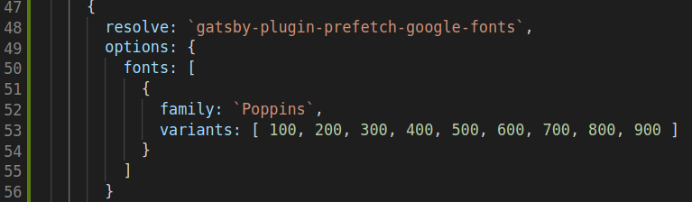

  
\
Today we are going to add typography and change the alignments of the site.  
\
To start with, `gatsby-plugin-prefetch-google-fonts` is added to the config file. This is added to have google fonts enabled in the website. There are other ways we can add fonts to the gatsby website. But we chose to go by plugins.  

\
  
\
Added font `poppins` to the site.  
\
**Mischalaneous**  
 
- Added static height to the tiles in the dashboard as each have different sized images and text.
- `overflow:hidden` for the text inside the tile to restrict long titles.
- Used CSS variables to color the text in the entire site so in future changes it is easy to change the text color at one place.
- Added the author and created date of the blog below the title.
- Changed the site title to link which will navigate to the dashboard.
- Hover effects for the tiles in dashboard.

